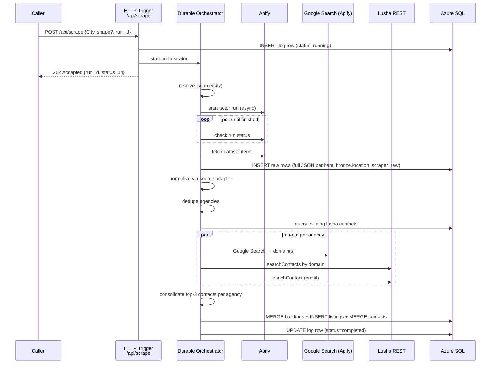

# Location Scraper — Azure Functions

Replaces the n8n "Location Scraper" workflow (`jfCPRkxxpDRLC7Rm`).

Scrapes commercial office listings from **Idealista** (Spain / Italy), **Otodom** (Poland), and **Immobilienscout24** (Germany), enriches them with contact data via **Lusha**, and persists everything to Azure SQL under the `bronze` schema.

---

## Architecture



### Orchestrator steps (in order)

| Step | Activity | Description |
|------|----------|-------------|
| 1 | `ls_resolve_source` | Maps `City` → country / actor / start URL |
| 2 | `ls_start_apify_run` | Fires Apify actor (async, no wait) |
| 3 | `ls_check_apify_run` | Polls status with timer loop (max ~40 min) |
| 4 | `ls_fetch_dataset` | Downloads all dataset items |
| 4b | `ls_persist_raw` | Writes each Apify row to `bronze.location_scraper_raw` (`payload_json`) |
| 5 | `ls_normalize` | Dispatches to source adapter |
| 6 | `ls_dedupe_agencies` | Extracts unique agency names |
| 7 | `ls_filter_new_agencies` | Removes agencies already in SQL with Lusha |
| 8 | `ls_enrich_agency` × N | Fan-out: one activity per agency, parallel |
| 9 | `ls_consolidate_contacts` | Dedup + seniority sort + top-3 per agency |
| 10 | `ls_upsert_sql` | Single MERGE pass into SQL |
| 11 | `ls_write_logs` | Mark run completed in SQL + App Insights |

---

## HTTP contract

### Request

```
POST /api/scrape
Content-Type: application/json

{
  "City":   "madrid",          // required — case-insensitive
  "shape":  "ABCD...",         // optional — URL-encoded polygon (Idealista only)
  "run_id": "my-run-abc123"    // optional — UUID generated if omitted
}
```

### Response — 202 Accepted

The response body is the Durable Functions standard check-status payload:

```json
{
  "id": "<orchestration-instance-id>",
  "statusQueryGetUri": "https://.../runtime/webhooks/durabletask/instances/<id>",
  "sendEventPostUri": "...",
  "terminatePostUri": "...",
  "purgeHistoryDeleteUri": "..."
}
```

Poll `statusQueryGetUri` to track progress. When `runtimeStatus` is `"Completed"`, the `output` field contains `RunStats`:

```json
{
  "run_id": "my-run-abc123",
  "city": "madrid",
  "source": "idealista",
  "buildings_found": 87,
  "buildings_new": 12,
  "buildings_updated": 3
}
```

### Supported cities

| City | Country | Source |
|------|---------|--------|
| `madrid` | Spain | Idealista |
| `barcelona` | Spain | Idealista |
| `seville` | Spain | Idealista |
| `valencia` | Spain | Idealista |
| `milan` | Italy | Idealista |
| `warsaw` | Poland | Otodom |
| `berlin` | Germany | Immobilienscout24 |
| `munich` | Germany | Immobilienscout24 |
| `hamburg` | Germany | Immobilienscout24 |
| `cologne` | Germany | Immobilienscout24 |
| `frankfurt` | Germany | Immobilienscout24 |
| `dusseldorf` | Germany | Immobilienscout24 |
| `stuttgart` | Germany | Immobilienscout24 |

---

## Adding a new source

1. Implement `shared/location_scraper/adapters/<source>.py` following the `SourceAdapter` protocol in `adapters/base.py`.  
   - Set `actor_id` to the Apify actor ID.  
   - Implement `build_input(start_url)` → Apify actor input dict.  
   - Implement `normalize(raw_item, city)` → `Listing | None`.

2. Register it in `shared/location_scraper/adapters/registry.py`:
   ```python
   from shared.location_scraper.adapters.mymarket import MyMarketAdapter
   ADAPTER_REGISTRY["mymarket"] = MyMarketAdapter()
   ```

3. Add the city entries in `shared/location_scraper/config.py` under `COUNTRY_CONFIG`.

That's it — no orchestrator changes needed.

---

## SQL schema

All tables live in the `bronze` schema. Run the following DDL before the first deploy:

```sql
CREATE TABLE bronze.n8n_location_scraper_buildings (
    id                  UNIQUEIDENTIFIER PRIMARY KEY DEFAULT NEWID(),
    source              NVARCHAR(50)    NOT NULL,
    external_id         NVARCHAR(255),
    web_link            NVARCHAR(1000),
    link_to_gmap        NVARCHAR(500),
    latitude            NUMERIC(9,6),
    longitude           NUMERIC(9,6),
    address             NVARCHAR(500),
    postal_code         NVARCHAR(20),
    district            NVARCHAR(255),
    city                NVARCHAR(100),
    floor               SMALLINT,
    floor_raw           NVARCHAR(50),
    is_exterior         BIT,
    has_lift            BIT,
    has_air_conditioning BIT,
    match_confidence    NVARCHAR(50)    DEFAULT 'inferred',
    updated_at          DATETIME2       DEFAULT GETUTCDATE()
);

CREATE TABLE bronze.n8n_location_scraper_listings (
    id                  UNIQUEIDENTIFIER PRIMARY KEY DEFAULT NEWID(),
    building_id         UNIQUEIDENTIFIER NOT NULL
        REFERENCES bronze.n8n_location_scraper_buildings(id),
    run_id              NVARCHAR(100),
    status              NVARCHAR(50),
    available_surface_m2 DECIMAL(10,2),
    price_monthly       DECIMAL(12,2),
    price_per_m2        DECIMAL(10,2),
    currency            NVARCHAR(10),
    energy_class        NVARCHAR(10),
    days_on_market      INT,
    first_listed_date   DATE,
    last_updated_date   DATE,
    first_time_extract  DATE,
    last_seen_date      DATE NOT NULL
);

CREATE TABLE bronze.n8n_location_scraper_contacts (
    id          UNIQUEIDENTIFIER PRIMARY KEY DEFAULT NEWID(),
    name        NVARCHAR(255),
    phone       NVARCHAR(50),
    email       NVARCHAR(255) UNIQUE,
    contact_type NVARCHAR(50),
    title       NVARCHAR(255),
    confidence  DECIMAL(5,2),
    linkedin    NVARCHAR(500),
    source      NVARCHAR(50),   -- 'scraper' | 'lusha'
    updated_at  DATETIME2 DEFAULT GETUTCDATE()
);

CREATE TABLE bronze.n8n_location_scraper_listing_contacts (
    listing_id  UNIQUEIDENTIFIER NOT NULL
        REFERENCES bronze.n8n_location_scraper_listings(id),
    contact_id  UNIQUEIDENTIFIER NOT NULL
        REFERENCES bronze.n8n_location_scraper_contacts(id),
    PRIMARY KEY (listing_id, contact_id)
);

CREATE TABLE bronze.n8n_location_scraper_logs (
    run_id            NVARCHAR(100) PRIMARY KEY,
    city              NVARCHAR(100),
    run_date          DATE,
    source            NVARCHAR(50),
    buildings_found   INT DEFAULT 0,
    buildings_new     INT DEFAULT 0,
    buildings_updated INT DEFAULT 0,
    status            NVARCHAR(20)  DEFAULT 'running',  -- running | completed | failed
    created_at        DATETIME2     DEFAULT GETUTCDATE(),
    updated_at        DATETIME2     DEFAULT GETUTCDATE()
);
```

Also run `scripts/sql_scripts/location_scraper_raw_and_quality.sql` to create:

- `bronze.location_scraper_raw` — one row per Apify dataset item (`payload_json` = full JSON).
- `bronze.location_scraper_run_quality` — one row per completed run (counts for monitoring contact/extract quality).

For raw JSON field discovery (before building/changing a globe view), run:

- `scripts/sql_scripts/location_scraper_raw_schema_discovery.sql`
- it returns:
  - recent run quality snapshots
  - discovered JSON paths with observed types + row coverage
  - candidate globe-field fill rates per JSON path

---

## Environment variables

| Variable | Required | Description |
|----------|----------|-------------|
| `APIFY_TOKEN` | Yes | Apify API token |
| `LUSHA_API_KEY` | Yes | Lusha API key (sent as `api_key` header) |
| `AZURE_SQL_CONNECTION_STRING` | Yes | Full ODBC connection string (or use SERVER+DATABASE+UID+PWD) |
| `AzureWebJobsStorage` | Yes | Storage account connection string (Durable Functions state) |
| `ENABLE_LOCATION_SCRAPER_FUNCTIONS` | Yes | Set to `1` to register functions |
| `APPLICATIONINSIGHTS_CONNECTION_STRING` | No | Application Insights connection string for custom events |

Add these to your `.env` locally and to the Function App app settings in Azure.

---

## Lusha API endpoints

| Operation | Method | Endpoint |
|-----------|--------|----------|
| Search contacts by domain | POST | `https://api.lusha.com/v2/contacts/search` |
| Enrich contact by ID | POST | `https://api.lusha.com/v2/person/enrich` |
| Search individual | POST | `https://api.lusha.com/v2/person/search` |

Auth: `api_key` request header on every call.  
Retries: tenacity — 3 attempts, exponential backoff 2–30 s, retry on HTTP 429 / 5xx.

---

## Running locally

```powershell
# 1. Install dependencies
.\venv\Scripts\pip install -r requirements.txt

# 2. Copy and populate env
copy .env.example .env

# 3. Run resolve_source smoke test (no external deps)
.\venv\Scripts\python -m pytest tests\test_location_scraper_resolve_source.py -v

# 4. Run full e2e test (Apify + Lusha + SQL mocked)
.\venv\Scripts\python -m pytest tests\test_location_scraper_idealista_e2e.py -v

# 5. Start the Function App locally (requires Azure Functions Core Tools v4)
func start

# 6. Trigger a scrape
curl -X POST http://localhost:7071/api/scrape \
  -H "Content-Type: application/json" \
  -d '{"City": "madrid", "run_id": "local-test-001"}'
```

The response includes a `statusQueryGetUri` — poll it to watch the orchestration progress.

---

## Deployment

```powershell
# Enable the location scraper on the Function App
az functionapp config appsettings set `
  --resource-group infinitspace-prod-northeurope-data-rg `
  --name func-infinitspace-etl `
  --settings ENABLE_LOCATION_SCRAPER_FUNCTIONS=1 `
             APIFY_TOKEN=<your-token> `
             LUSHA_API_KEY=<your-key>

# Deploy
func azure functionapp publish func-infinitspace-etl --python
```

CI/CD: push to `main` (with changes in `functions/location_scraper.py` or `shared/location_scraper/`) → `.github/workflows/deploy_location_scraper.yml` runs tests then deploys automatically.

Required GitHub secrets: `AZURE_CLIENT_ID`, `AZURE_TENANT_ID`, `AZURE_SUBSCRIPTION_ID` (OIDC).

---

## Out-of-scope sources (deliberately dropped)

The following Apify actors existed in the original n8n workflow as **disabled dead code** and have not been ported:

- Rightmove UK (`OtFA20rCfQZatC6Nt`)
- Loopnet 🇺🇸 (`RuOxoBM1bnc5pQ3TJ`)
- Crexi 🇺🇸 (`JeaJthm26KstkYpr6`)
- Zoopla UK (`YnypKXp7X4cey27F8`)
- Immobilienscout24 DE (`ciTdHfgOkkwfEzTE9`)

Use the "Adding a new source" guide above to re-introduce any of them.

---

## Open questions

1. **Loopnet `customBody` hardcoded `"new-york-ny"`** — the n8n Loopnet actor input always used `new-york-ny` regardless of the `City` input field. Confirm whether this was intentional (fixed geography) or a bug before re-introducing Loopnet.

2. **`Insert listing` and `Insert contact` run on every upsert or insert only?** — In n8n these nodes ran only on the INSERT path (new buildings). The UPDATE path only appended a new listing snapshot with no contact write. This behaviour is preserved here. Confirm whether contacts should also be refreshed/updated when a building's price changes.

3. **Lusha "Search Individuals" parallel vs sequential** — the n8n workflow ran the individual-contact path in parallel with the company-domain path. When both return data for the same agency, the current implementation uses whichever path succeeded (they are mutually exclusive by the `is_individual()` check). If future use cases can produce both, clarify the merge strategy.

4. **Otodom polygon/shape support** — Otodom's URL structure does not expose a polygon filter the way Idealista does. The current implementation silently ignores `shape` for Warsaw. Confirm whether bounding-box parameters via the Otodom API or actor options are acceptable.

5. **Lusha API endpoint verification** — the Lusha endpoint paths (`/v2/contacts/search`, `/v2/person/search`, `/v2/person/enrich`) were inferred from public Lusha developer documentation. Verify against your active Lusha plan and API version before production use.
