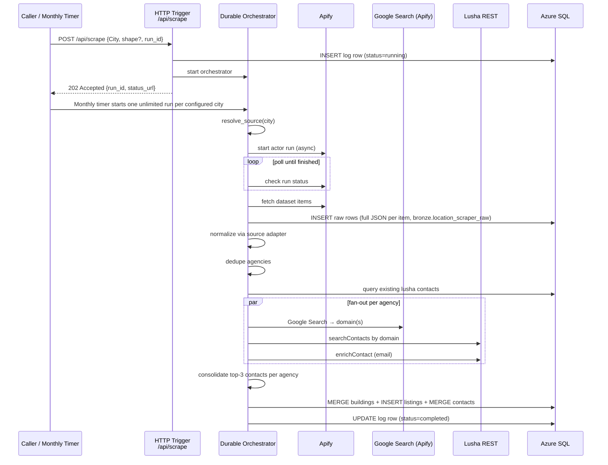

# Location Scraper — Azure Functions

Replaces the n8n "Location Scraper" workflow (`jfCPRkxxpDRLC7Rm`).

Scrapes commercial office listings from **Idealista** (Spain / Italy), **Otodom** (Poland), **Immobilienscout24** (Germany), and **LoopNet** (UK — London), enriches them with contact data via **Lusha**, and persists everything to Azure SQL under the `bronze` schema.

---

## Architecture



### Orchestrator steps (in order)

| Step | Activity | Description |
|------|----------|-------------|
| 1 | `ls_resolve_source` | Maps `City` → country / actor / start URL |
| 1b | `ls_enumerate_loopnet_urls` | LoopNet gb/ca only: listing-detail URLs from the filtered search pages. Retried `LOCATION_SCRAPER_ENUM_ATTEMPTS` times — an empty result is transient (the residential edge refusing the actor), and falling straight through to the broad search costs ~90% of the city |
| 2 | `ls_start_apify_run` | Fires Apify actor (async, no wait) |
| 3 | `ls_check_apify_run` | Polls status with timer loop (max ~40 min) |
| 4 | `ls_fetch_dataset` | Downloads all dataset items |
| 4b | `ls_persist_raw` | Writes each Apify row to `bronze.location_scraper_raw` (`payload_json`) |
| 4c | `ls_assess_run_health` | Grades the attempt (detail-fetch losses + volume baseline). Steps 1b–4c repeat up to `LOCATION_SCRAPER_MAX_ATTEMPTS` times while the verdict is degraded; the best attempt is the one kept |
| 5 | `ls_normalize` | Dispatches to source adapter |
| 6 | `ls_dedupe_agencies` | Extracts unique agency names |
| 7 | `ls_filter_new_agencies` | Removes agencies already in SQL with Lusha |
| 8 | `ls_enrich_agency` × N | Fan-out: one activity per agency, parallel |
| 9 | `ls_consolidate_contacts` | Dedup + seniority sort + top-3 per agency |
| 10 | `ls_upsert_sql` | Single MERGE pass into SQL |
| 11 | `ls_write_logs` | Mark the run `completed` (or `degraded`) in SQL + App Insights |

### Run health: `completed` vs `degraded`

A scrape can finish `SUCCEEDED` on Apify and still carry a fraction of the city.
Both failure modes are upstream and transient, which is why the pipeline retries
rather than fails:

- **Detail-fetch losses.** LoopNet locked its mobile API behind App Check, so the
  memo23 actor 403s on every listing and recovers each one through a paid
  unblocker chain. When that chain is throttled the listing is simply dropped —
  the 2026-08-17 wave lost 34/48 London listings, 252/329 Los Angeles, 78/89
  Austin. The loss rate is time-of-day dependent: every post-403 daytime sample
  recovers 95–100%, every 01:00 UTC sample 19–29%.
- **Empty enumeration.** The gb/ca enumeration actor returns 0 URLs when the
  residential edge refuses it, silently degrading the city to the broad search.
- **Exhausted unblocker quota.** That chain is shared by every user of the actor
  and it runs dry (`scrapingbee is quota-throttled (HTTP 401)`). Then even the
  *search* stage fails on loopnet.com — which has no enumeration path to fall
  back on — and the city returns nothing at all. Measured 2026-08-18: a single
  317-listing London recovery run drained it, and all 11 cities started
  afterwards returned 0. This one is **not** worth retrying, so the verdict
  carries `retry_useless` and the attempt loop stops immediately; the quota is
  only ever a retry signal, never a quality one (a run that delivers its city
  and drains the budget on the way out is still a good run).

`ls_assess_run_health` reads both signals — the actor's own per-listing markers
in its run log, and the city's best raw volume over the last
`LOCATION_SCRAPER_BASELINE_RUNS` runs (`bronze.location_scraper_run_quality`) —
and returns a verdict. A degraded attempt is retried after
`LOCATION_SCRAPER_RETRY_DELAY_MINUTES`; the attempt with the most items wins and
its dataset is re-persisted, so a weaker retry never overwrites a better run.

A run that is still degraded after every attempt keeps its buildings (they are
real) but is logged `degraded` with the reason in `error_message`. That status
matters operationally: `ls_cities_needing_run` only skips `completed`, so the
city is picked up again by the mid-week pass.

### Weekly schedule

`location_scraper_weekly` runs on `LOCATION_SCRAPER_WEEKLY_SCHEDULE`, default
`0 0 8 * * 1` (Mondays 08:00 UTC), starting one parent orchestration per ISO week
(`weekly-{city}-{YYYY-Www}`) in sequential waves of `LOCATION_SCRAPER_WAVE_SIZE`.

The 08:00 UTC slot is deliberate: the same London scrape lost 39/48 listings at
01:13 UTC and 2/48 at 08:46 UTC on the same day (2026-07-20), and 21/395 at
10:36 UTC on 2026-07-31. Moving off the small hours is the cheapest half of the
fix — the graded retry above is the other half.

`location_scraper_weekly_retry` (`LOCATION_SCRAPER_WEEKLY_RETRY_SCHEDULE`,
default `0 0 8 * * 3`, Wednesdays 08:00 UTC) starts the same parent for the
current week under its own instance id. `ls_cities_needing_run` keeps only the
cities whose weekly row is not `completed`, so a clean week is a no-op and a bad
Monday gets a second, independent attempt before anyone notices.

When at least one city ends the week unhealthy, `ls_alert_run_health` emails the
full city table to `LOCATION_SCRAPER_ALERT_RECIPIENTS` (falling back to
`SYNC_REPORT_RECIPIENTS`). A clean week sends nothing.

### Monthly schedule

`location_scraper_monthly` runs on `LOCATION_SCRAPER_MONTHLY_SCHEDULE`, default `0 0 1 1 * *` (01:00 UTC on the first day of each month). It starts one Durable orchestration per city with `unlimited_items=true`, so the Apify actor input omits `maxItems` and the dataset fetch reads all returned items.

Scheduled cities: `barcelona`, `madrid`, `milan`, `berlin`, `munich`, `hamburg`, `cologne`, `frankfurt`, `dusseldorf`, `stuttgart`, `warsaw`, `london`, `new york`, `san francisco`, `palo alto`, `los angeles`, `austin`, `seattle`, `redwood city`, `san mateo`, `san bruno`, `cupertino`, `toronto`.

---

## HTTP contract

### Request

```
POST /api/scrape
Content-Type: application/json

{
  "City":   "madrid",          // required — case-insensitive
  "shape":  "ABCD...",         // optional — URL-encoded polygon (Idealista only)
  "run_id": "my-run-abc123"    // optional — UUID generated if omitted
}
```

### Response — 202 Accepted

The response body is the Durable Functions standard check-status payload:

```json
{
  "id": "<orchestration-instance-id>",
  "statusQueryGetUri": "https://.../runtime/webhooks/durabletask/instances/<id>",
  "sendEventPostUri": "...",
  "terminatePostUri": "...",
  "purgeHistoryDeleteUri": "..."
}
```

Poll `statusQueryGetUri` to track progress. When `runtimeStatus` is `"Completed"`, the `output` field contains `RunStats`:

```json
{
  "run_id": "my-run-abc123",
  "city": "madrid",
  "source": "idealista",
  "buildings_found": 87,
  "buildings_new": 12,
  "buildings_updated": 3
}
```

### Supported cities

| City | Country | Source |
|------|---------|--------|
| `madrid` | Spain | Idealista |
| `barcelona` | Spain | Idealista |
| `seville` | Spain | Idealista |
| `valencia` | Spain | Idealista |
| `milan` | Italy | Idealista |
| `warsaw` | Poland | Otodom |
| `berlin` | Germany | Immobilienscout24 |
| `munich` | Germany | Immobilienscout24 |
| `hamburg` | Germany | Immobilienscout24 |
| `cologne` | Germany | Immobilienscout24 |
| `frankfurt` | Germany | Immobilienscout24 |
| `dusseldorf` | Germany | Immobilienscout24 |
| `stuttgart` | Germany | Immobilienscout24 |
| `london` | UK | LoopNet |
| `new york` | US | LoopNet |
| `san francisco` | US | LoopNet |
| `palo alto` | US | LoopNet |
| `los angeles` | US | LoopNet |
| `austin` | US | LoopNet |
| `seattle` | US | LoopNet |
| `redwood city` | US | LoopNet |
| `san mateo` | US | LoopNet |
| `san bruno` | US | LoopNet |
| `cupertino` | US | LoopNet |
| `toronto` | Canada | LoopNet |

#### LoopNet (UK + US + Canada) notes

- Actor: `memo23/loopnet-scraper-ppe` (`0ZCQONxB3BdyOzrbD`), pay-per-event (~$1.50/1k). The
  $31/mo flat-rate twin (`RuOxoBM1bnc5pQ3TJ`) is intentionally **not** used.
- The same actor serves **US, UK and Canada**, but the URL shape differs by country
  (resolved per `COUNTRY_CONFIG` block, same `loopnet` branch in `resolve.py`):
  - **UK** (`uk`): `…/search/office-properties/{city}-england--united-kingdom/for-rent/`.
    City slug must include region + country (`london-england--united-kingdom`) — the
    actor geocodes the search area from the URL, so a bare `london` slug fails.
  - **US** (`us`): `…/search/office-space/{city}-{state}/for-lease/` (note
    `office-space` + `for-lease`, not `office-properties` + `for-rent`). City slug is
    `{city}-{state-abbrev}`, e.g. `new-york-ny`, `san-francisco-ca`, `palo-alto-ca`,
    `los-angeles-ca`, `austin-tx`, `seattle-wa`, `redwood-city-ca`, `san-mateo-ca`,
    `san-bruno-ca`, `cupertino-ca`. Multi-word city names
    contain a space (`new york`, `redwood city`) — the weekly timer slugifies them
    (`new-york`, `redwood-city`) for `run_id`/instance ids.
  - **Canada** (`canada`): own domain `loopnet.ca`, US-style path + suffix:
    `https://www.loopnet.ca/search/office-space/{slug}/for-lease/`. City slug needs the
    province + `--canada` (UK convention): `toronto-on--canada` — the bare `toronto-on`
    404s. Verified live: `?min-space-size=16146` → 189 Toronto office results.
  - Currency is derived from the country (GB → GBP, CA → CAD, otherwise USD) since
    LoopNet has no currency field.
- Areas are in **square feet** → converted to m² (×0.092903). The **≥1500 m²** floor is
  enforced in code (adapter + globe materialization), not via the actor's URL filter
  (which filters total building size, not available area).
- LoopNet payloads carry **no coordinates** → filled by the geocode fallback. Broker
  name / company / phone / **email** come directly from the payload.
- **Broker directory (name→email memory)**: `silver.location_scraper_broker_directory`
  remembers every (broker name → email) pair ever observed (2,447 pairs seeded from the
  raw archive). During globe materialization, LoopNet listings whose broker has a NAME
  but no EMAIL — the shape the actor regressed to twice in 2026 — are back-filled from
  the directory (conservative matching: ambiguous names only resolve on a company
  tie-break). Every run self-enriches the directory. Module:
  `shared/location_scraper/broker_directory.py`; seed/backfill:
  `scripts/python_scripts/backfill_broker_directory.py` (NB: export the prod
  `GOOGLE_MAPS_API_KEY` before `--rematerialize`, else Nominatim shifts marker
  clustering).
- **Lusha is fully skipped for LoopNet** (`LUSHA_SKIP_SOURCES` in
  `functions/location_scraper.py`): the orchestrator bypasses dedupe/enrich/consolidate.
  The broker contact is still persisted to `bronze.n8n_location_scraper_contacts`
  (`source='scraper'`) by `ls_upsert_sql`, and the broker email(s) are surfaced in the
  globe's email slots via `_loopnet_broker_contacts` in `materialize_globe.py`
  (email coverage observed at 100% on ≥1500 m² London listings).

---

## Adding a new source

1. Implement `shared/location_scraper/adapters/<source>.py` following the `SourceAdapter` protocol in `adapters/base.py`.  
   - Set `actor_id` to the Apify actor ID.  
   - Implement `build_input(start_url)` → Apify actor input dict.  
   - Implement `normalize(raw_item, city)` → `Listing | None`.

2. Register it in `shared/location_scraper/adapters/registry.py`:
   ```python
   from shared.location_scraper.adapters.mymarket import MyMarketAdapter
   ADAPTER_REGISTRY["mymarket"] = MyMarketAdapter()
   ```

3. Add the city entries in `shared/location_scraper/config.py` under `COUNTRY_CONFIG`.

That's it — no orchestrator changes needed.

---

## SQL schema

All tables live in the `bronze` schema. Run the following DDL before the first deploy:

```sql
CREATE TABLE bronze.n8n_location_scraper_buildings (
    id                  UNIQUEIDENTIFIER PRIMARY KEY DEFAULT NEWID(),
    source              NVARCHAR(50)    NOT NULL,
    external_id         NVARCHAR(255),
    web_link            NVARCHAR(1000),
    link_to_gmap        NVARCHAR(500),
    latitude            NUMERIC(9,6),
    longitude           NUMERIC(9,6),
    address             NVARCHAR(500),
    postal_code         NVARCHAR(20),
    district            NVARCHAR(255),
    city                NVARCHAR(100),
    floor               SMALLINT,
    floor_raw           NVARCHAR(50),
    is_exterior         BIT,
    has_lift            BIT,
    has_air_conditioning BIT,
    match_confidence    NVARCHAR(50)    DEFAULT 'inferred',
    updated_at          DATETIME2       DEFAULT GETUTCDATE()
);

CREATE TABLE bronze.n8n_location_scraper_listings (
    id                  UNIQUEIDENTIFIER PRIMARY KEY DEFAULT NEWID(),
    building_id         UNIQUEIDENTIFIER NOT NULL
        REFERENCES bronze.n8n_location_scraper_buildings(id),
    run_id              NVARCHAR(100),
    status              NVARCHAR(50),
    surface_m2          DECIMAL(10,2),   -- canonical, always m²
    surface_display     DECIMAL(12,2),   -- value in display unit (sqft for UK/US, else m²)
    surface_unit        NVARCHAR(10),    -- 'sqft' | 'm2'
    price_monthly       DECIMAL(12,2),
    price_per_m2        DECIMAL(10,2),
    currency            NVARCHAR(10),
    energy_class        NVARCHAR(10),
    days_on_market      INT,
    first_listed_date   DATE,
    last_updated_date   DATE,
    first_time_extract  DATE,
    last_seen_date      DATE NOT NULL
);

CREATE TABLE bronze.n8n_location_scraper_contacts (
    id          UNIQUEIDENTIFIER PRIMARY KEY DEFAULT NEWID(),
    name        NVARCHAR(255),
    phone       NVARCHAR(50),
    email       NVARCHAR(255) UNIQUE,
    contact_type NVARCHAR(50),
    title       NVARCHAR(255),
    confidence  DECIMAL(5,2),
    linkedin    NVARCHAR(500),
    source      NVARCHAR(50),   -- 'scraper' | 'lusha'
    updated_at  DATETIME2 DEFAULT GETUTCDATE()
);

CREATE TABLE bronze.n8n_location_scraper_listing_contacts (
    listing_id  UNIQUEIDENTIFIER NOT NULL
        REFERENCES bronze.n8n_location_scraper_listings(id),
    contact_id  UNIQUEIDENTIFIER NOT NULL
        REFERENCES bronze.n8n_location_scraper_contacts(id),
    PRIMARY KEY (listing_id, contact_id)
);

CREATE TABLE bronze.n8n_location_scraper_logs (
    run_id            NVARCHAR(100) PRIMARY KEY,
    city              NVARCHAR(100),
    run_date          DATE,
    source            NVARCHAR(50),
    buildings_found   INT DEFAULT 0,
    buildings_new     INT DEFAULT 0,
    buildings_updated INT DEFAULT 0,
    status            NVARCHAR(20)  DEFAULT 'running',  -- running | completed | failed
    created_at        DATETIME2     DEFAULT GETUTCDATE(),
    updated_at        DATETIME2     DEFAULT GETUTCDATE()
);
```

Also run `scripts/sql_scripts/location_scraper_raw_and_quality.sql` to create:

- `bronze.location_scraper_raw` — one row per Apify dataset item (`payload_json` = full JSON).
- `bronze.location_scraper_run_quality` — one row per completed run (counts for monitoring contact/extract quality).

For raw JSON field discovery (before building/changing a globe view), run:

- `scripts/sql_scripts/location_scraper_raw_schema_discovery.sql`
- it returns:
  - recent run quality snapshots
  - discovered JSON paths with observed types + row coverage
  - candidate globe-field fill rates per JSON path

---

## Environment variables

| Variable | Required | Description |
|----------|----------|-------------|
| `APIFY_TOKEN` | Yes | Apify API token |
| `LUSHA_API_KEY` | Yes | Lusha API key (sent as `api_key` header) |
| `LOCATION_SCRAPER_MAX_ITEMS` | No | Common max items cap applied to manually triggered scraper actors (`idealista`, `otodom`, `immobilienscout`). If unset, actor defaults are used (100 / 200 / 100). Monthly scheduled runs explicitly omit `maxItems`. |
| `LOCATION_SCRAPER_MONTHLY_SCHEDULE` | No | NCRONTAB schedule for the monthly all-city scrape; default `0 0 1 1 * *`. |
| `LOCATION_SCRAPER_WEEKLY_SCHEDULE` | No | NCRONTAB schedule for the weekly all-city scrape; default `0 0 8 * * 1` (Mon 08:00 UTC). Keep it out of the small hours — see *Run health* above. |
| `LOCATION_SCRAPER_WEEKLY_RETRY_SCHEDULE` | No | NCRONTAB schedule for the mid-week pass over cities that did not complete; default `0 0 8 * * 3` (Wed 08:00 UTC). |
| `LOCATION_SCRAPER_MAX_ATTEMPTS` | No | Scrape attempts per city before a degraded run is accepted as-is; default `3`. |
| `LOCATION_SCRAPER_RETRY_DELAY_MINUTES` | No | Wait between attempts; default `30`. |
| `LOCATION_SCRAPER_DETAIL_LOSS_THRESHOLD` | No | Share of candidate listings the actor may drop before the run is degraded; default `0.20` (healthy runs sit at 0–7%). |
| `LOCATION_SCRAPER_BASELINE_RATIO` | No | Share of the city's best recent volume a run must reach; default `0.6`. |
| `LOCATION_SCRAPER_BASELINE_RUNS` | No | How many previous runs define that baseline; default `8`. |
| `LOCATION_SCRAPER_ENUM_ATTEMPTS` | No | LoopNet gb/ca enumeration attempts before falling back to the broad search; default `3`. |
| `LOCATION_SCRAPER_ENUM_RETRY_MINUTES` | No | Wait between enumeration attempts; default `5`. |
| `LOCATION_SCRAPER_ALERT_RECIPIENTS` | No | Comma-separated recipients of the weekly degraded-cities email; falls back to `SYNC_REPORT_RECIPIENTS`. |
| `GOOGLE_MAPS_API_KEY` | No | Geocoding for listings without coordinates (e.g. LoopNet). If unset, falls back to the **free Nominatim (OpenStreetMap)** geocoder automatically. |
| `NOMINATIM_URL` / `NOMINATIM_USER_AGENT` | No | Override the free geocoder endpoint / User-Agent (defaults to the public OSM endpoint). |
| `AZURE_SQL_CONNECTION_STRING` | Yes | Full ODBC connection string (or use SERVER+DATABASE+UID+PWD) |
| `AzureWebJobsStorage` | Yes | Storage account connection string (Durable Functions state) |
| `ENABLE_LOCATION_SCRAPER_FUNCTIONS` | Yes | Set to `1` to register functions |
| `APPLICATIONINSIGHTS_CONNECTION_STRING` | No | Application Insights connection string for custom events |

Add these to your `.env` locally and to the Function App app settings in Azure.

---

## Lusha API endpoints

| Operation | Method | Endpoint |
|-----------|--------|----------|
| Search contacts by domain | POST | `https://api.lusha.com/v2/contacts/search` |
| Enrich contact by ID | POST | `https://api.lusha.com/v2/person/enrich` |
| Search individual | POST | `https://api.lusha.com/v2/person/search` |

Auth: `api_key` request header on every call.  
Retries: tenacity — 3 attempts, exponential backoff 2–30 s, retry on HTTP 429 / 5xx.

---

## Running locally

```powershell
# 1. Install dependencies
.\venv\Scripts\pip install -r requirements.txt

# 2. Copy and populate env
copy .env.example .env

# 3. Run resolve_source smoke test (no external deps)
.\venv\Scripts\python -m pytest tests\test_location_scraper_resolve_source.py -v

# 4. Run full e2e test (Apify + Lusha + SQL mocked)
.\venv\Scripts\python -m pytest tests\test_location_scraper_idealista_e2e.py -v

# 5. Start the Function App locally (requires Azure Functions Core Tools v4)
func start

# 6. Trigger a scrape
curl -X POST http://localhost:7071/api/scrape \
  -H "Content-Type: application/json" \
  -d '{"City": "madrid", "run_id": "local-test-001"}'
```

The response includes a `statusQueryGetUri` — poll it to watch the orchestration progress.

---

## Deployment

```powershell
# Enable the location scraper on the Function App
az functionapp config appsettings set `
  --resource-group infinitspace-prod-northeurope-data-rg `
  --name func-infinitspace-etl `
  --settings ENABLE_LOCATION_SCRAPER_FUNCTIONS=1 `
             APIFY_TOKEN=<your-token> `
             LUSHA_API_KEY=<your-key>

# Deploy
func azure functionapp publish func-infinitspace-etl --python
```

CI/CD: push to `main` (with changes in `functions/location_scraper.py` or `shared/location_scraper/`) → `.github/workflows/deploy_location_scraper.yml` runs tests then deploys automatically.

Required GitHub secrets: `AZURE_CLIENT_ID`, `AZURE_TENANT_ID`, `AZURE_SUBSCRIPTION_ID` (OIDC).

---

## Out-of-scope sources (deliberately dropped)

The following Apify actors existed in the original n8n workflow as **disabled dead code** and have not been ported:

- Rightmove UK (`OtFA20rCfQZatC6Nt`)
- Crexi 🇺🇸 (`JeaJthm26KstkYpr6`)
- Zoopla UK (`YnypKXp7X4cey27F8`)

Use the "Adding a new source" guide above to re-introduce any of them.

> **LoopNet** has since been wired in (London / UK) via the pay-per-event actor
> `memo23/loopnet-scraper-ppe` (`0ZCQONxB3BdyOzrbD`) — see the "LoopNet (UK) notes"
> above. The original flat-rate actor (`RuOxoBM1bnc5pQ3TJ`) referenced here was
> dropped in favour of the pay-per-event twin.

---

## Open questions

1. ~~**Loopnet `customBody` hardcoded `"new-york-ny"`**~~ — *Resolved.* The new LoopNet
   integration builds the search URL per-city from `COUNTRY_CONFIG` (London uses
   `london-england--united-kingdom`); the old hardcoded body is not used.

2. **`Insert listing` and `Insert contact` run on every upsert or insert only?** — In n8n these nodes ran only on the INSERT path (new buildings). The UPDATE path only appended a new listing snapshot with no contact write. This behaviour is preserved here. Confirm whether contacts should also be refreshed/updated when a building's price changes.

3. **Lusha "Search Individuals" parallel vs sequential** — the n8n workflow ran the individual-contact path in parallel with the company-domain path. When both return data for the same agency, the current implementation uses whichever path succeeded (they are mutually exclusive by the `is_individual()` check). If future use cases can produce both, clarify the merge strategy.

4. **Otodom polygon/shape support** — Otodom's URL structure does not expose a polygon filter the way Idealista does. The current implementation silently ignores `shape` for Warsaw. Confirm whether bounding-box parameters via the Otodom API or actor options are acceptable.

5. **Lusha API endpoint verification** — the Lusha endpoint paths (`/v2/contacts/search`, `/v2/person/search`, `/v2/person/enrich`) were inferred from public Lusha developer documentation. Verify against your active Lusha plan and API version before production use.
